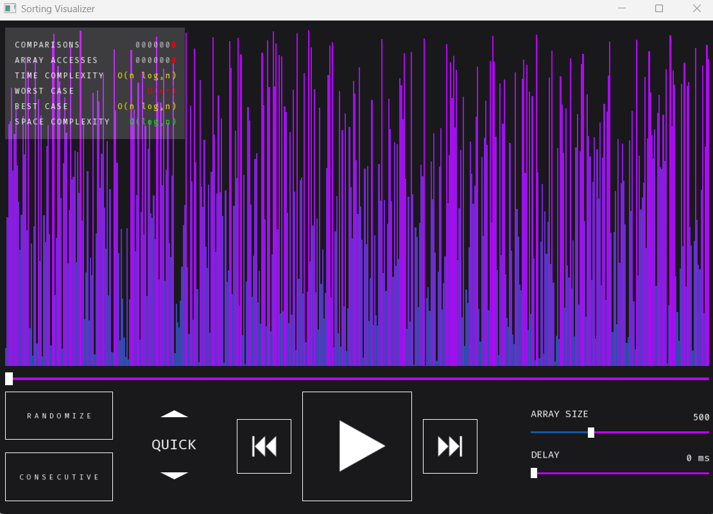

# Sorting Visualizer

A high-performance sorting algorithm visualizer built from scratch using C++ and the Simple and Fast Multimedia Library (SFML). Featuring a custom rendering engine, it includes a timeline scrubber that allows you to control the visualization like a video player.



## [ /// THE ARCHITECTURE /// ]

The core, unique feature of this program is its custom animation timeline. Most visualizers force the user to watch a sort from start to end. This project changes that, using **delta encoding** to perfectly record changes in the array as reversible actions.

This architecture allows the user to: 
- Pause and resume the animation at any moment
- Step forward or backwards frame-by-frame to properly digest each step in an algorithm
- Use the timeline slider to seamlessly scrub backward and forward through time

## [ /// USAGE /// ]

Using this program is as simple as clicking on the screen with your mouse! Interact with the control deck to randomize the array, change the array size, adjust the sorting delay, cycle algorithms, and scrub through the animation!

Beyond the GUI, you can also control certain aspects with shortcuts:
- **Up/Down Arrows**: Cycle algorithms
- **Left/Right Arrows**: Step backwards or forwards in time by one frame, respectively
- **Space Bar**: Play, pause, or resume animation
- **R**: Restart animation
- **Scroll Wheel**: If the mouse is near the sorting algorithm's name, scroll to cycle algorithms

## [ /// BUILD INSTRUCTIONS /// ]

If you want to build the program yourself, you will need these prerequisites:

1. CMake v3.16 or higher
2. C++20 Compiler (e.g., GCC, MSVC, Clang)
3. SFML v3.x or higher

### Compiling on macOS / Linux

Unix-based systems can natively resolve SFML if installed via a package manager.

1. Install SFML v3.x using your package manager:

    ```
    macOS: brew install sfml
    ```
    ```
    Ubuntu/Debian: sudo apt-get install libsfml-dev
    ```

2. Clone the repository:

    ```bash
    git clone https://github.com/Proderp/SortingVisualizer.git
    cd SortingVisualizer
    ```

3. Generate the build files. You do not need to provide the directory to your SFML on a Unix-based system.

    ```bash
    cmake -B build -DCMAKE_BUILD_TYPE=Release
    cmake --build build
    ```

4. Run the application:

    ```bash
    ./build/app
    ```

### Compiling on Windows

1. Clone the repository:
    ```bash
    git clone https://github.com/Proderp/SortingVisualizer.git
    cd SortingVisualizer
    ```

2. Generate the build files. For Windows, you must provide CMake with the path to your SFML installation's CMake directory using the -DSFML_DIR flag:

    ```bash
    cmake -B build -DSFML_DIR="C:/path/to/your/SFML/lib/cmake/SFML"
    ```

3. Compile the executable:

    ```bash
    cmake --build build --config Release
    ```

You should now have an executable, but it still needs to be linked. If you are compiling on Windows using dynamic linking, app.exe requires the SFML .dll files to run. If you attempt to launch the executable directly and receive a "Missing DLL" error, choose one of the following solutions:

**Option A**: Add the bin directory of your SFML installation (e.g., C:/SFML/bin) to your Windows System PATH environment variable. This allows Windows to locate the .dlls automatically.

**Option B**: Copy `sfml-graphics-3.dll`, `sfml-window-3.dll`, and `sfml-system-3.dll` from your SFML bin directory and paste them directly into your build/Release folder right next to app.exe.

Once you have done that, you can now run app.exe by just double-clicking it or running: 

```bash
.\build\Release\app.exe
```

## [ /// MOTIVATION /// ]

I made this project to learn about sorting algorithms as an exposition to Data Structures and Algorithms. I also learned much more about graphics rendering, data representation, and C++ as a whole. 

I also made this because when looking for online resources for sorting algorithm visualizers, many of them lacked good educational features. Most lacked a critical feature: the ability to pause/resume and look at the visualization at your own pace. I was pretty disappointed in this. After all, what is the point of an 'educational' sorting visualizer if the user cannot control the flow of the animation and experiment with it? I wanted to solve that by making my own visualizer that aims to have the necessary features to be an educational tool for students like me (and still super satisfying).

I coded this whole project by myself, and no Generative AI was used in making this project!

## [ /// AUTHOR /// ]

**Jalwin Grayser Jas Winston** (he/him) - HBSc Computer Science Co-op Program, Lakehead University. Check out my other projects!

**My GitHub**: [My Repositories!](https://github.com/Proderp)

**My LinkedIn**: [LinkedIn](https://www.linkedin.com/in/jalwin-grayser-jas-winston-1103a2401/)

## [ /// ACKNOWLEDGEMENTS /// ]

* [SFML](https://www.sfml-dev.org/) - The underlying C++ multimedia API I used for graphics rendering.
* [Fira Code](https://github.com/tonsky/FiraCode) - The monospaced font powering the jitter-free HUD.

## [ /// LICENSE /// ]

This project is licensed under the MIT License - see the [LICENSE](LICENSE) for details.
